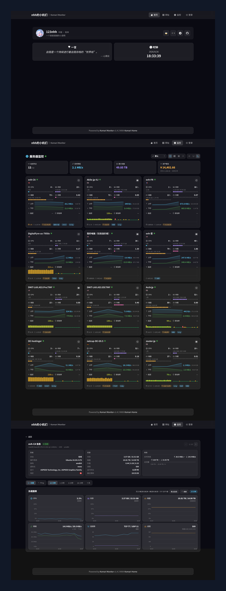

<div align="center">


# Komari Home Plus

**让你的探针变为你的个人主页！**

> 融合 [Komari-Home](https://github.com/mogumc/Komari-Home) 与 [Komari-Theme-LuminaPlus](https://github.com/shanyang242/Komari-Theme-LuminaPlus) 的个人化主题，前端基于 Vue 3 重构，监控页与实例详情页采用 LuminaPlus 的交互与数据模型。

[](https://tz.gq.ci/)
[](https://github.com/komari-monitor/komari)
[](https://vuejs.org)
[](https://vite.dev)
[](https://opensource.org/licenses/MIT)

[在线体验](https://tz.gq.ci/) · [功能一览](#-功能一览) · [安装](#-安装) · [配置指南](docs.md)



</div>

---

## 📖 项目介绍

Komari Home Plus 是基于 [Komari](https://github.com/komari-monitor/komari) 探针的**主题化个人主页**：首页保留 Komari-Home 的个人信息、社交链接、快速导航、一言/时钟、RSS 与自定义 HTML；探针页与实例详情页则移植 LuminaPlus 的卡片体系——多视图切换、明暗主题、延迟/丢包健康区、流量配额条、流量趋势曲线、国旗/IP 徽章与资产概览。

所有内容通过 Komari 后台**动态配置**，无需修改代码即可完成全部自定义。

## ✨ 功能一览

### 首页

| 模块 | 说明 |
|:---|:---|
| **个人信息** | 头像、昵称、简介、所在地、社交链接（hover 显示名称，icon 支持图片 URL） |
| **一言 & 时钟** | 随机一言引用 + 实时时钟组件，可独立开关 |
| **RSS 订阅** | 自动解析 RSS/Atom 格式，最多展示 4 条 |
| **自定义 HTML** | 任意 HTML 片段，直接渲染在首页 |
| **快速链接** | 首页底部图标网格导航，响应式 2~5 列自适应 |
| **网址导航** | 独立页面，分类卡片展示，支持图标和描述 |

### 探针页

| 模块 | 说明 |
|:---|:---|
| **多视图切换** | 大卡 / 小卡 / 迷你卡 / 列表，localStorage 持久化 |
| **明暗主题** | 浅色 / 跟随系统 / 深色三档切换，统一 CSS 令牌 |
| **首页总览** | 在线节点 / 实时带宽 / 累计流量 / 资产概览（汇率换算剩余价值） |
| **服务器卡片** | 国旗徽章、OS 图标、IPv4/IPv6 徽章（默认关闭）、CPU/内存/磁盘/负载分段指标条、上下行速率与流量趋势曲线、剩余流量配额条（绿→黄→红 18 段）、延迟 + 丢包率柱状历史图 |
| **排序** | 默认 / 名称 / 实时网速 / 累计流量 / 价格，升降序 |
| **资产概览** | 按币种实时汇率折算剩余预付价值与月均成本，支持忽略名单 |

### 实例详情页

| 模块 | 说明 |
|:---|:---|
| **信息面板** | 系统 / 资源 / 网络三组信息，总流量配额进度条，上/下一台切换 |
| **负载图表** | CPU / 内存 / 磁盘 / 网络 / 连接数 / 进程六张曲线卡，时间档位 10 分钟 / 1 小时 / 6 小时 / 24 小时 / 7 天 |
| **Ping 图表** | 多任务线路折线图，任务 chips 显示延迟/丢包并可单独隐藏，支持断点连线 |
| **硬件信息** | 处理器、系统、虚拟化、显卡等静态信息展示 |

## 🚀 安装

> 需要 Komari >= 1.3.0

**第一步** — 构建主题包：

```bash
npm install
npm run package
# 生成 Komari Home-v{version}.zip
```

**第二步** — 进入 Komari 后台 → **主题管理** → 上传主题包

**第三步** — 启用主题，在**主题设置面板**中填写个人信息与站点配置

> 💡 不知道 JSON 怎么填？查看 [配置指南](docs.md)，内含详细说明和 AI 提示词，复制粘贴即可生成。

## ⚙️ 配置速览

主题所有可配置项均在 `komari-theme.json` 中声明，安装后通过 Komari 后台的**主题设置面板**进行编辑。

| 配置项 | 类型 | 说明 |
|:---|:---:|:---|
| 头像链接 | 文本 | 头像图片 URL |
| 显示名称 | 文本 | 首页昵称 |
| 个人简介 | 文本 | 简短签名 |
| 所在地 | 文本 | 如：中国 · 上海 |
| 社交链接 | JSON | 头像右侧图标按钮，`name` / `icon` / `url`（icon 可为图片 URL） |
| 首页快速链接 | JSON | 首页底部网格导航，`name` / `icon` / `url` |
| 网址导航 | JSON | 导航页卡片列表，`name` / `icon` / `desc` / `url` |
| RSS 订阅 | 开关 + URL | RSS/Atom 订阅源 |
| 自定义 HTML | 富文本 | 任意 HTML 片段 |
| 背景图片 | 文本 | 全屏背景图 URL |
| 一言 / 时钟 | 开关 | 独立控制显示 |
| 资产概览忽略节点 | 文本 | 不参与价值统计的服务器，节点名称或 UUID，逗号/换行分隔 |
| 显示节点 IP 徽章 | 开关 | 卡片头部 IPv4/IPv6 徽章，默认关闭 |

> 📖 每项 JSON 的详细格式、示例和 AI 生成提示词请查看 → [配置指南](docs.md)

## 🛠 开发

```bash
# 安装依赖
npm install

# 启动开发服务器（带模拟数据，便于查看探针页效果）
npm run dev:mock

# 生产构建
npm run build

# 构建 + 打包主题 zip
npm run package
```

**技术栈**：Vue 3 + Vue Router 4 + Vite 7 · Bootstrap Icons · Komari JSON-RPC 2.0 API

## 📄 许可

[MIT License](https://opensource.org/licenses/MIT)